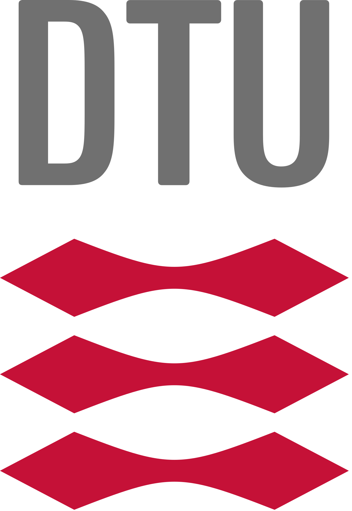
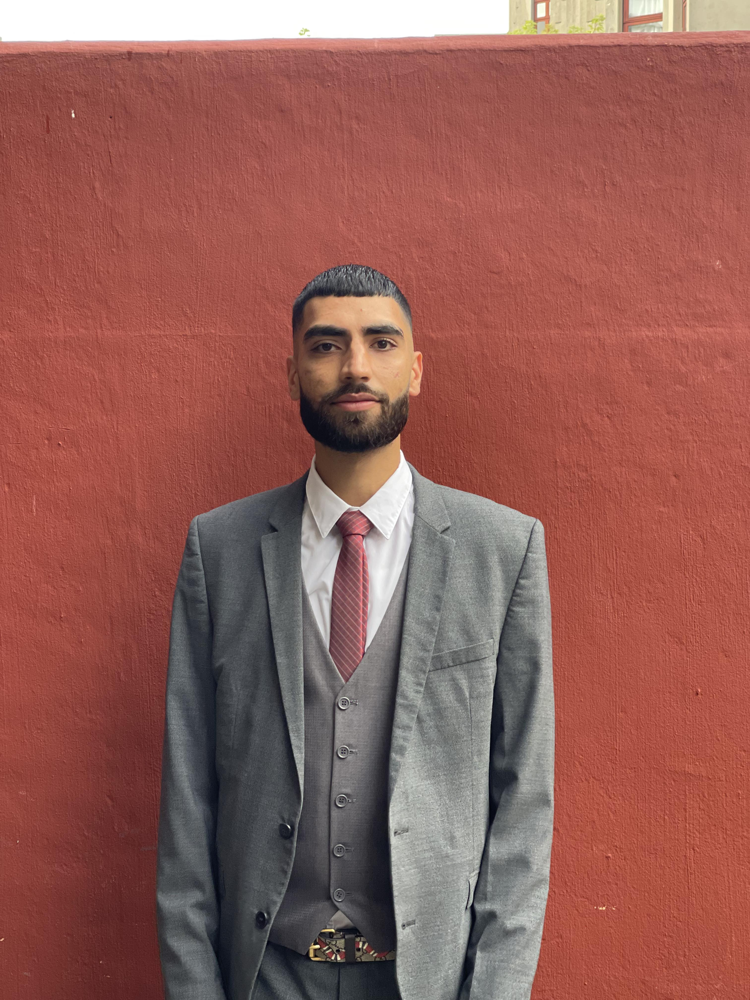
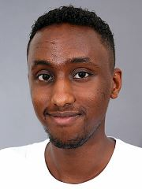
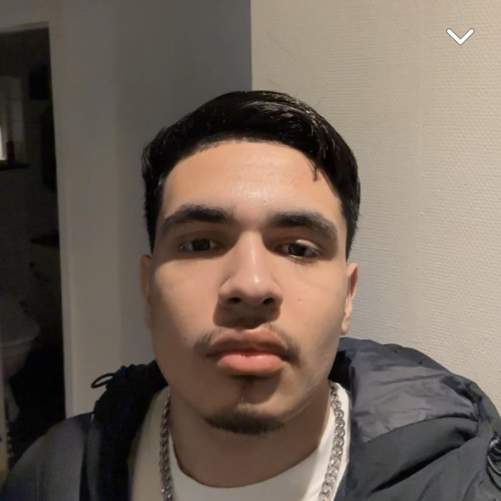
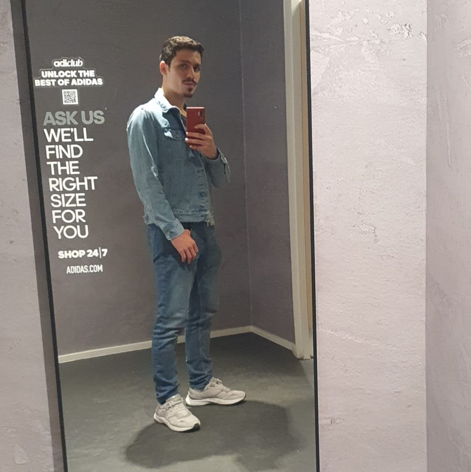
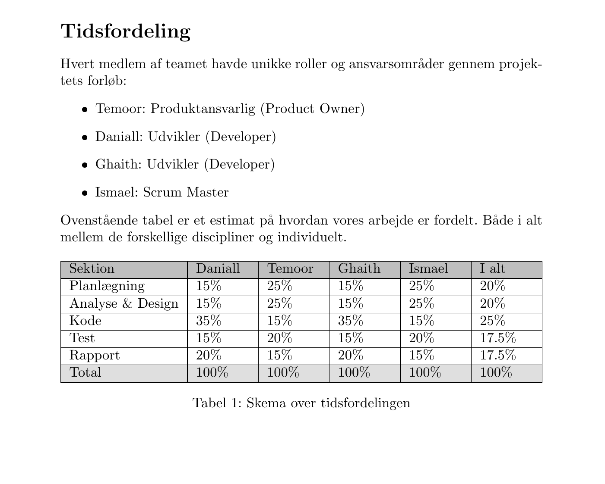
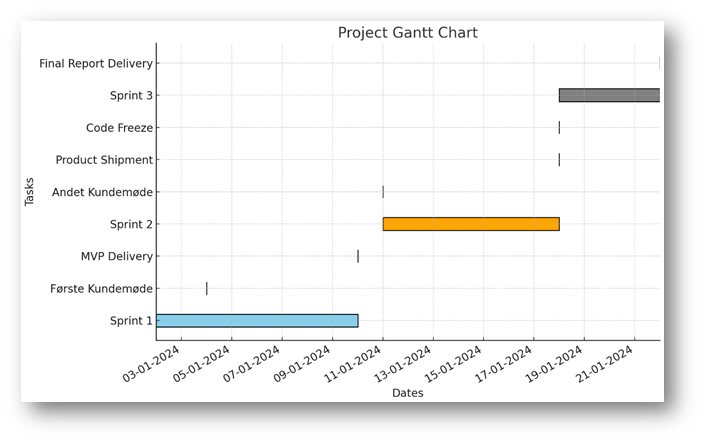
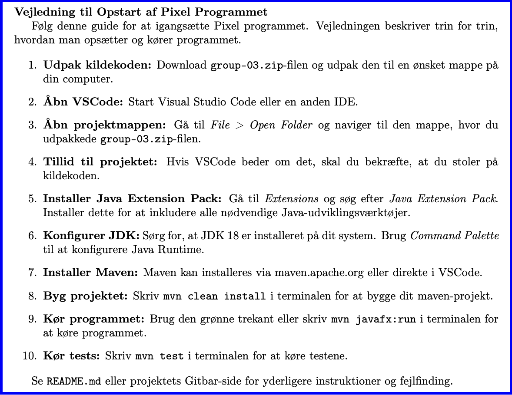
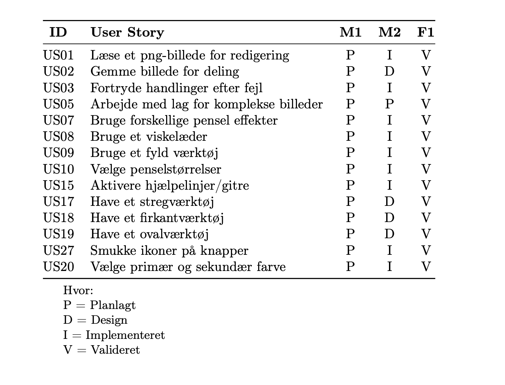
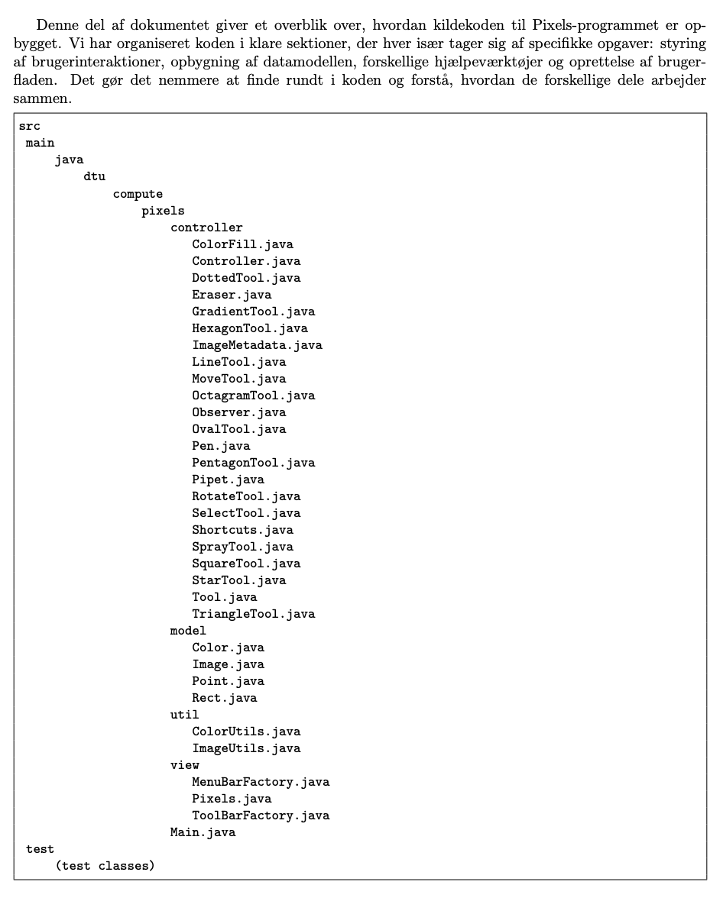

<!-- Front Page -->

# Danmarks Tekniske Universitet

---

## 02316 Introductory Programming

## Group 3

### Projektrapporten:

<!-- Attempt to center table with inline style -->

<table>
  <tr>
    <td> Mohammed Temoor Mir s224798</td>
    <td> Mohammed Josef Ismael s235079</td>
  </tr>
  <tr>
    <td> Daniall Mudaser s235070</td>
    <td> Ghaith Bassem Altayeb s235090</td>
  </tr>
</table>

---

Januar 22, 2024

<!-- Indledning -->

# Indledning:
I dette 3-ugers projekt, har vi som en gruppe fokuseret på at udvikle et tegneprogram ved brug af JavaFX library inden for Java. Vores primære mål var at skabe et brugervenligt og funktionelt værktøj til tegning, der effektivt imødekommer kundens specifikke behov og forventninger. Dette program er resultatet af agil SCRUM-udviklingsproces, der fremmer teamdynamik, løbende forbedringer og tilpasningsevne til projektændringer. Vi har også brugt Jira til Project Management, hvilket er standarden i industrien. I Jira, har vi lavet vores SCRUM Board, hvilket har været essentielt til at holde styr på vores user stories og vores deadlines.

Projektet blev struktureret i 3 sprints: det første sprint fra den 2. til den 10. januar, det andet sprint fra den 11. til den 18. januar og det tredje fra den 18. januar til den 22. januar som var dedikeret til skrivning af vores projektrapport. Under disse sprints har vi været engageret i daglige stand-up møder, både fysisk og online, for at sikre en konstant og effektiv kommunikation inden for teamet. Disse møder har været kritiske for at spore fremskridt, identificere udfordringer hurtigt og facilitere problemløsning i realtid. Ydermere, har vi også haft to kundemøder, den 4. januar og den 11. januar. Til vores anden kundemøde, skulle vi aflevere vores Minimum Viable Product (MVP) hvorefter vi fik brugbar feedback af hjælpelærerne som var hjælpsom til næste sprint.

Det program, som vi har udviklet, tilbyder en bred vifte af værktøjer og funktioner. Disse inkluderer standardværktøjer som pen og spray, samt mere avancerede elementer som udfyldningsværktøj, forskellige geometriske figurer, gradientværktøj og avanceret lag-håndtering. User Interface (UI) er nøje designet til at være intuitivt og let tilgængeligt, hvilket gør det nemt for brugere at navigere og effektivt benytte de forskellige funktioner.

Med et fundament i Java og JavaFX-library, har vi skabt en stabil platform for vores grafiske brugerinterface. Vores udviklingsproces har været præget af en stærk tilgang til objektorienteret programmering (OOP) og anvendelse af designmønstre, som vi lærte på 1. semester, hvilket har bidraget til en struktureret og vedligeholdelsesvenlig kodebase.

Dette projekt har været en dybtgående læringsproces, hvor vi ikke kun har udviklet et software produkt, men også har opnået værdifuld erfaring med teamwork, agile udviklingsmetoder og betydningen af kontinuerlig feedback fra vores hjælpelærere. Denne rapport vil detaljeret præsentere og diskutere vores udviklingsproces, de anvendte teknologier og arkitekturer, og vil reflektere over udfordringerne under projektets forløb samt vores tilgange til at overkomme disse.

# Tidsfordeling:

    

# Projekt Planlægning:
Vores gruppe anvendte en metodisk tilgang til at administrere ressourcer og opgaver. Ved brug af Jira til at oprette et SCRUM-board, har vi fået et klart overblik over projektets progression, hvilket har gjort det muligt at følge hver enkelt User Story fra start til slut. Vores gruppe havde aftalt at holde daglige stand-up møder fysisk på skolen så ofte som muligt, og på dage, hvor det ikke har været muligt, har vi anvendt Messenger/Discord som vores primære kommunikationsplatform.

### Project Gantt Chart

    

**Projektledelse med Jira:** Vores brug af et SCRUM-board i Jira har været essentielt for en velorganiseret arbejdsproces. Ved at definere kolonner såsom 'To Do', 'In Progress' og 'Done', har hvert medlem af teamet kunnet få en umiddelbar statusopdatering på opgaver og prioriteringer.

**Prioritering af User Stories med Jira:** Gennem anvendelsen af MoSCoW-metoden i vores sprint planlægning indenfor Jira har vi effektivt identificeret de mest essentielle user stories for vores Minimum Viable Product (MVP), samt dem der kunne udskydes.

**Sprint Planlægning:** Vores sprints, som typisk strakte sig over en uge, blev indledt med et møde, hvor vi diskuterede og forpligtede os til de user stories, der skulle adresseres. Dette sikrede, at alle medlemmer havde tydelige mål og var bevidste om forventningerne til dem i sprintets løb.

**Ressourcehåndtering og Fleksibilitet:** Ved at vise hensyn til hinandens forskellige livsstil og vaner, har vi tilstræbt et fleksibelt arbejdsmiljø, hvor personlig frihed og fælles ansvarlighed har balanceret hinanden. Vi har sikret, at alle konstant havde relevante opgaver, og at arbejdsbelastningen blev fordelt retfærdigt.

**Kundemøder:**
Ved vores første møde med kunden den 4. januar, havde vi forberedt en liste over use cases, som vi mente ville imødekomme kundens behov. Gennem dialogen med kunden tilpassede vi efterfølgende vores prioritetsliste for at sikre overensstemmelse med kundens præferencer.

Ved det andet møde den 11. januar præsenterede vi vores MVP og modtog feedback, der var afgørende for projektets videre forløb, herunder tilføjelse af nye user stories og forbedringer af eksisterende funktioner.

Ved det afsluttende møde den 18. januar demonstrerede vi det færdige produkt og dets funktioner, hvilket gav kunden lejlighed til at vurdere og kommentere på det endelige resultat.

Denne proces har ikke kun resulteret i udviklingen af et softwareprodukt, men også et effektivt team, som har evnen til at arbejde agilt og imødekomme projektets og kundens krav.

# Analyse:

**Kravsanalyse:**
Udviklingen af dette tegneprogram begyndte som en overtagelse af et projekt fra en tidligere udvikler som havde sagt jobbet op. Vores kunde havde specifikke behov for programmet udviklet i JavaFX, som skulle muliggøre skabelsen af digitale tegninger og billedredigering.Vi blev præsenteret for en detaljeret beskrivelse af de funktioner og værktøjer, som programmet skulle indeholde.  Gennem vores initialanalyse og kundedialog identificerede vi en række nøglefunktioner og værktøjer, der skulle inkorporeres i programmet for at imødekomme disse behov.
Brugerne til programmet vil få  adgang til værktøjer, der omfatter heriblandt  pensler, viskelæder, colorfill og mange andre former for redigerings værktøjer. Programmet skulle helst indeholde en række geometriske former såsom firkanter og ovaler, der kan tilpasses efter behov, disse figurer kan brugere trække og placerer på deres lærred. Programmet skal også kunne indlæses og gemmes billeder i PNG, så det er meget nemmere for brugerne at dele sine værker med deres venner og bekendte samt indlæse billeder for at redigere videre på gemte billeder.
I tæt dialog med kunden har vi udarbejdet en prioritetsliste for de essentielle funktioner til den første version af tegneprogrammet. Vi vil bruge denne liste til at hjælpe os igennem processen mens vi udvikler programmet,  så det vil være muligt for  kunden  at løbende vurdere vores fremskridt.
Disse krav blev formaliseret gennem en række use cases , som blev gennemgået og prioriteret af gruppen. Dette blev gjort ved hjælp af Moscow modellen, denne tilgang står for ‘Must have’, ‘should have’, ‘Could have’, og ‘Won’t have. Denne proces sikrede, at vi havde en klar forståelse af de mest kritiske aspekter af programmet før vores første møde med kunden.

# User Stories:

Efter det indledende møde med kunden blev det aftalt, at det Minimal Viable Product (MVP) skulle have 13 kernefunktioner samt 2 supplerende funktioner. Disse 15 funktioner, som kunden bad os om at udvikle, var overvejende essentielle for at sikre en basal funktionel oplevelse for brugeren og var kritiske for at opretholde programmets konceptuelle integritet. Samtidig inkluderede dette sæt af funktioner også nogle elementer, der primært bidrager til at forfine programmet og forbedre User Experience (UX) med yderligere nuancer.

Under udviklingen af MVP'en, blev der lagt vægt på at implementere de mest vigtige funktioner til at starte med. Denne tilgang omfattede indledningsvis de enklere funktioner, der primært krævede omstrukturering af kode, efterfulgt af gradvis integration af de mere nuancerede funktioner. Dette tilrettelagde en skala af prioriteter, hvor de mere komplekse funktioner, som ikke var essentielle for MVP-mødet, kunne udelades, hvis de ikke kunne færdiggøres til tiden. Denne strategi sikrede en robust struktur for det endelige produkt og resulterede i et funktionelt MVP, der tilfredsstillede brugerens fundamentale behov. Resultatet var, at programmets frontend muligvis ikke fremstod helt fuldendt, men det var dog fuldt funktionsdygtigt.

Sådan så vores User Stories i Jira ud da vi var i gang med vores sprints:

    

    

    

    

Vi har også lavet et aktivitetsdiagram, efter at vi har identificeret user stories, for at få et overblik over brugerens aktiviteter i programmet.

  

# Første møde med kunden:
Ved det første kundemøde præsenterede vi overfor kunden vores plan samt vision for projektets gang. Vi præsenterede hvilke user stories vi mente var vitale at få implementeret som det første, derudover havde vi inddelt alle de første 20 User Stories i en prioriteringsliste fra vigtigst til mindst vigtig. Kunden præsenterede så deres vision og krav på hvad der var vigtigt for dem at vi skulle have klar til Minimum viable product (MVP) og efterfulgt af en vurdering af kundens krav havde vi en plan klar for hvad vi ville have klar til MVP.

# Navneords analyse:
For at lave en navneords analyse baseret på kravene, skal vi identificere substantiver, der potentielt kan repræsentere klasser i vores program. Her er en navneords analyse:

Canvas - Et område eller overflade hvor brugeren kan tegne eller redigere billeder.
Layer - En del af canvas, som tillader opdeling af tegninger i separate, redigerbare sektioner.
Shape - Geometriske figurer eller tegneelementer, som kan placeres på et layer.
ColorFill - Et værktøj eller funktion, der anvendes til at udfylde en shape med en bestemt farve.
Image - En repræsentation af et grafisk billede, som kan gemmes eller indlæses.
UndoRedo - Et system eller en funktion, der tillader brugeren at fortryde eller gentage handlinger. de here navneord ræoresenterer de vigtigste klasser i vores program og relationerne har vi brugt til at modelerer dem i et forhold i et klasse diagram.

# MVP:
Inden anden kundemøde var det påkrævet af os at få lavet “minimal viable product” (MVP), udfra dette kunne vores fremskidt vurderes samt det kunne godtjekkes om projektet bevægede sig i den rette retning. Til alle første kundemøde lagde vi i sammenarbejde med kunden en plan for hvad der skulle være lavet til MVP, dette indebar en priorteringsliste fra kundens side af på hvad de vurderede til at være vigtigst til mindst vigtig for dem. Derudover havde vi også selv en plan om hvad vi ville kunne nå og hvad vores plan var at implementere.
Vores overordnede plan for MVP var således fra højest priorteret til lavest:
- US7
- US1
- US2
- US3
- US5
- US10
- US8
- US9
- US15
- US17
- US18
- US19

Derudover hvis vi kunne nå det så ville vi også gerne have følgende to user stories klaret:
- Smukke ikoner
- Sekonder farve (primær farve var allerde lavet)

Dette var så planen det vi faktisk nået var følgende:
US1-US8 samt US21

Efter vi havde snakket med kunden og vi fik godkendt vores kravspecification, lavede vi et System Diagram. Dette gjorde vi for at få et overblik over hvad vores program skulle indeholde. 

    

Her er et domænmodel baseret på de User Stories som var en del af vores MVP:

    

Vi har også lavet et sekvensdiagram, der illustrerer interaktionen mellem en bruger og de forskellige komponenter i et tegneprogram. Det viser processen fra start af applikationen til vælgelse og brug af værktøjer som tegning, farvefyldning og laghåndtering, samt anvendelse af undo/redo funktioner og gemning af billedet. Brugerens valg af sekundær farve og afslutning af sessionen er også inkluderet. Diagrammet bruger alternative segmenter for at repræsentere forskellige brugerbeslutninger under tegneprocessen.

    

## Andet kundemøde:

Det andet kundemøde fandt sted efter at vi havde afleveret MVP, dermed præsenterede vi så vores produkt til kunden med de User stories vi havde fået implementeret, der viste sig at være nogle små problemer med programmet såsom at nogle af funktionerne ikke var færdiglavet eller fuldtudviklede det vil sige der var nogle mangler i dem. Derfor udarbejdede vi i sammenarbjede med kunden en revideret plan over hvad der skulle laves og forbedres inden Product shipment altså det endelige produkt. Derudover fik vi nogle flere funktioner fra kunden som de godt kunne tænke sig vi fik lavet her var der også nogle af funktionerne der vægtede mere end andre. Nævningsværdigt fra disse nye tilføjelser som kunden kunne tænke sig at vi kiggede på var som bland andet: “gif” funktion det vil sige at man skulle kunne tegne sine egne gifs i programmet. En anden tilføjelse kunden bad om var: at vi skulle viderudvikle på vores “layer” funktion sådan at man nu skulle kunne “merge” det vil sige sammensætte lagene samt “duplicate” det vil sige duplikere et lag.

## Design:
Vores projekt fokuserer på udvikling og design af et fuld-funktionel Pixels program, som er inspireret af Microsoft-Paint. For at sikre en solid og vedligeholdelses projektstruktur. Fra begyndelsen af vores projekt, lagde vi stor vægt på anvendelsen af principper fra General Responsibility Assignment Software Patterns (GRASP). Ydermere gennem store dele af projektet blev der sat fokus på at opnå lav kobling (Low Coupling) og høj sammenhæng (High Cohesion). Meningen med dette var at minimere fejl og bugs i fremtiden, som ville resultere i en smooth, effektiv udvikling af Pixels.

**Controller-strukturen:**
Kernen i vores program-arkitektur, har vi bl. a. Controller-klassen, som har en vigtig rolle, som tjener som et centraliseret kontrolpunkt for brugerinteraktioner og forretningslogik. Controlleren forbindes med en række værktøjer inden i tool mappen. Denne mappe indeholder ColorFill, Dotted Tool, Eraser m.m. Alle disse værktøjer implementerer tool-interface. Dette er med til at skabe en solid ansvarsfordeling, for hver værktøjs-klasse, som resultere i en høj sammenhæng. For at undgå en overvældet og højt koblet controller, som kunne have resulteret i en besværlig og kompleks kode, indførte vi yderligere controllers såsom; ImageMetadata og Observer. Disse hjalp med at dele ansvaret for at håndtere forskellige aspekter af pixels, hvilket effektivt reducerede antallet af direkte afhængigheder mellem klasser.

**Værktøjskasserne og Polymorfi:**
Brugen af polymorphism ses tydeligt i implementeringen af de forskellige tool-klasser. Selvom hver værktøjskasse har være i sære forskellige formål og håndterer forskellige brugerinteraktioner, såsom at tegne, fortryde, udfylde farver, skabe gradienter osv, deler de grænseflade, hvilket gør systemet mere modulært. Klasserne for de specifikke værktøjer udviser også en høj sammenhæng ved kun at indeholde logik, der er relevante for deres specifikke funktioner.

**Separation of Concerns (SoC):**
SoC-princippet blev anvendt for at adskille brugergrænsefladen fra forretningslogikken. Dette blev opnået gennem et klart skel mellem view-pakken, som håndterer visning af brugergrænsefladen, og resten af applikationens logik. view-pakken indeholder klasser som MenuBarFactory og ToolBarFactory, som skaber brugergrænsefladen, mens model-mappen som indeholder grundlæggende data strukturer herunder; Color, Image, Point, og Rect. Herved er ansvar for datahåndtering og brugerinteraktion tydeligt opdelt, hvilket resulterer i et mere solid og let forståeligt kodning projekt.

**Designprincipper i Praksis:**
Gennem anvendelsen af principperne om Low Coupling og High Cohesion sikrede vi, at klasser og metoder havde minimale afhængigheder og var tæt relateret til de user stories, de var designet til at udføre. For eksempel, util-klasserne ColorUtils og ImageUtils tilbyder hjælpefunktioner, som forenkler farvekonvertering og billedhåndtering, og sikrer dermed, at disse operationer ikke spredes over forskellige klasser.

    

### Dette er mere en let læslig Diagram!

    

I det følgende afsnit vil der gås dybere ind i teorien og beskrive, hvordan vi anvendte GRASP-mønstrene i forhold til specifikke aspekter af projektet.

**Teori og Anvendelse af GRASP Patterns:**

**Polymorphism:**
Polymorfi spiller en vigtig faktor i vores applikationsdesign, som giver os mulighed for at definere en fælles interface for vores værktøjer. Med klasser såsom; ColorFill, DottedTool, Eraser osv, der alle implementerer Tool-interfacet, kan vi udnytte polymorfi til at udvide systemets funktionalitet uden at skulle ændre i controlleren eller andre dele af systemet. Dette resulterer i en nemgang, af tilføjelser af nye værktøjer i fremtiden og gør systemet mere solid over for store ændringer.

**Low Coupling:**
For at opnå såkaldt “Low coupling” i vores system har vi isoleret afhængighederne mellem klasserne. For eksempel har vi Controller-klassen, som fungerer som en mellemled mellem brugergrænsefladen og domænemodellen. Dette sikrer, at ændringer i brugergrænsefladen kan foretages uafhængigt af domænemodellen og omvendt. Desuden opnår vi “Low coupling” ved at begrænse direkte referencer mellem værktøjskasserne og resten af systemet, hvilket gør systemet mere fleksibelt og lettere at vedligeholde.

**High Cohesion:**
“High Cohesion” blev sikret ved at gruppere relateret funktionalitet sammen. For eksempel indeholder Image Utils-klassen metoder til billede operationer, og Color Utils-klassen indeholder farvekonvertering logik. Denne tilgang sikrer, at klasserne ikke bliver "gud"-klasser, der forsøger at gøre for meget, hvilket igen holder vedligeholdelsen enkel og forbedrer systemets læsbarhed og forståelse.

**Controller Pattern:**
Controller-mønsteret blev anvendt til at skabe Controller-klassen, som håndterer indgående forespørgsler fra brugergrænsefladen. Denne klasse har ansvaret for at delegerer arbejdet til relevante værktøjer eller hjælpeklasser. Dette mønster hjalp med at centralisere beslutningslogikken og reducerede spredningen af handlingslogik over hele systemet.

**Information Expert:**
Information Expert-princippet hjalp os med at bestemme, hvor ansvar skulle placeres i systemet. For eksempel er klasser som Image og Color blevet tildelt ansvaret for at kende og manipulere billed- og farvedata, da de besidder den nødvendige information til at udføre disse opgaver.

**Protected Variations:***
For at beskytte vores system mod ændringer anvendte vi interfaces og abstraction. Dette ses i vores brug af Tool-interfacet, som beskytter systemet mod ændringer i implementeringen af individuelle værktøjer. Hver Tool-implementering kan ændres uafhængigt af de andre og af controlleren, hvilket giver en beskyttet variation i systemets funktionalitet.

**Pure Fabrications:**
Pure Fabrications blev anvendt for at skabe klasser som ColorUtils og ImageUtils, som ikke nødvendigvis findes i det reelle problemområde, men som hjælper med at holde systemet sammenhængende og koblet lavt. Disse klasser tillader os at holde vores controller og domæne klasser rene og fokuserer på deres primære ansvar.

Selvom High Cohesion og Low Coupling ikke blev opnået i den grad, vi havde håbet, har anvendelsen af GRASP-principperne stadig bidraget til vores pixels-programstruktur og udviklingsproces. Fremadrettet anerkender vi behovet for at forbedre på disse områder og ser dette som en mulighed for videreudvikling og optimering af vores softwarearkitektur. Dog vil vi sige at disse GRASP-mønstre og designprincipper blev anvendt gennem hele designprocessen for at sikre, at vores system er robust og klar til fremtidige udvidelser.

# Implementation:

**Kørsel af Pixel**

    

    

## Feature Implementering:

Vi begyndte med de features, der allerede var lagt ud for os og manglede kun implementeringen af logikken. `US01` blev implementeret som en menuitem under filmenuen, men resulterede i ingenting, når den blev klikket på. Denne user story var særligt nem at implementere, da det kun krævede, at vi brugte de korrekte metoder fra `ImageUtils`-klassen for at konvertere billederne fra eller til det passende format.

Derefter startede vi på `US03` og `US07`, da de er meget vigtige for programmets grundlæggende behov, og det ville ikke give mening at levere en MVP, hvor brugeren ikke kan slette noget, de har tegnet, eller fortryde en ændring.

Derefter gik vi videre til de mere nuancerede funktioner og formåede at implementere User stories `17`, `15`, `10`, `9`, og `7`. På grund af mangel på tid kunne vi ikke opfylde User stories `18`, `19`, `5`, og `2`, men vi var i stand til at lægge layoutet for disse User stories for at kunne udvikle og implementere dem inden den endelige udgivelse.

Endnu engang, på grund af mangel på tid, måtte vi acceptere, at vi kun kunne validere de opnåede User stories ved hjælp af de accepttests, vi lavede, og ved selv at prøve programmet for at sikre, at den ønskede funktionalitet blev opnået.

### Konfigurations Styring:

Commit hash : `ad3f5d25011e5c5bf4499b4c4962d3e935aa341e`

Java version: `21.0.1`

Programmet blev kodet i VScode og den version der blev brugt er `1.8.5 2`

GUI biblioteket : `JavaFX`

Alle de dependencies der blev brugt kan ses i vores projekts `pom.xml` fil

Til at importere GUI’en og JUnit bruger vi `Maven`.

### Source Code list:

    

# Det endelige produkt

- Stort overblik over koden

### Pixels.java

 

    

- Vores kode er struktureret efter MVC-mønstre, hvilket betyder, at vi har et system, hvor der er en controller, der styrer alle ændringer mellem UI-elementerne og kondens data. Med det sagt, begynder vores kode i klassen "pixels," som er programmets  JavaFX UI-klasse, der initialiserer controlleren og  indeholder "start"-metoden, som laver scenen og bestemmer alt det som skal vises på scenen og hvor tingene skal ligge.

    

- "createCanvas" er en anden meget vigtig metode i klassen "pixels," der opretter canvas og vigtigst af alt bestemmer, hvordan det opfører sig. Denne metode synkroniserer lærredet med controlleren, så det registrerer alle de mulige mouse inputs som brugeren kan bruge til at interagere med canvas, og kalder de relevante metoder i controlleren (f.eks. "press," "update," "release," og "abandon") ”pixels" klassen  har metoden "onchange," som  er påkrævet at implementeres, da pixel klassen implementerer observer-interfacet. Denne metode bruges til at gemme alle de metoder, der skal udføres, hvis controlleren giver besked til alle dens observatører om en ændring. I vores tilfælde er det "redraw" metoden, der kaldes, når controlleren giver besked om en ændring, hvilket sørger for, at canvas har den seneste version af det opdaterede billede og/eller scratch.

### Controller.java

    

- "Controller klassen” udgør en afgørende komponent i backenden af en billedredigeringsapplikation og er ansvarlig for at styre billedredigering operationer og interaktioner mellem de forskellige værktøjer og canvas. Denne klasse er designet til at følge den arkitektoniske Model-View-Controller (MVC)-mønster, hvilket letter opdelingen af ansvarsområder mellem UI og den underliggende data og logik.

- På sin kerne indeholder klassen flere vigtige attributter og tilstandsvariabler. Disse inkluderer: 
Lister til styring af observatører og ændringer: Listen "observers" holder styr på observatører (normalt UI-komponenter), der skal underrettes, når der sker ændringer i applikationens tilstand. Listen "changes" bruges til at opbevare en historik over ændringer, der er foretaget på billedet, hvilket muliggør funktionalitet til at fortryde handlinger.

- Billedobjekter: Klassen administrerer tre billedobjekter - "image" repræsenterer hoved lærredet, hvor billedredigering finder sted, "scratch" er et midlertidigt lærred til midlertidige ændringer, inden de forpligtes til hovedbilledet, og "selectedSquare" bruges til at gemme en udvalgt del af billedet.

- Attributter relateret til værktøjer: Klassen holder styr på det aktuelle valgte værktøj (f.eks. tegneværktøjer som pen, viskelæder, figurer) og den aktuelle farve til tegneoperationer. Den administrerer også baggrundsfarve og sekundær farve.

- Diverse attributter: Der er flere andre attributter som zoomniveau, penselstørrelse og flag for synlighed af gitter og retningslinjer, der påvirker adfærden i applikationen(kig på klassediagrammet i appendiks for at se sammenhængen mellem klasserne og  strukturen af vores kode).

    

- Metoden DrawStraightLine gør brug af Bresenhams linjealgoritme for at oprette en gennemsnitlig værdi af to punkter mellem en linje inden for et grafisk sytem. Den laver koden for Start og slutpunkterne i koordinaterne (x0, y0) og (x1, y1). Den definerer også fejl, parametern og skridt størrelserne baseret på de positioner af de to punkter. Algoritmen har en kerne som ligger i dens iterative proces, hvor den næste  pixel position bliver bestemt på linjens vej baseret på fejlminimering i forhold til linjes hældning.

- Denne metode er meget smart for sin anvendelse af heltal aritmetik frem for de flydende punkters beregninger, som giver en fremgang til ydeevnen ved grafisk rendering.

- I hver gennemgang af processen vurderer algoritmen den samlede fejl ved at sætte den faktiske pixel bevægelse op mod den optimale rute for linjen. Der sker en beslutningsmekanisme, hvor der bliver justeret den nuværende position (x0, y0) enten i begge retninger eller enten ved ys’-retning, xs’-retning, afhængigt af de forudsete tærskelværdier sammenlignet med fejlens størrelse. Denne tilgangs måde forsikre at linjen bliver så tæt som muligt på den ideelle linjes bane over hele dens længde.  

### Layer feature

Idéen med denne feature var at give brugeren mulighed for at arbejde med forskellige lag efter ønske og lad  dem beslutte, hvilke lag der er aktive på et givet tidspunkt. Med en så kompleks tilføjelse til den eksisterende kode måtte koden for pixels og controller omstruktureres på en måde, der tillod det nye system at eksistere og fungere korrekt.

    

- For at kunne skifte frit mellem de forskellige lag med et enkelt klik blev der lavet en array list af typen billede i controller klassen til at gemme alle lagene, der tilføjes, så de kan bruges af forskellige klasser. CompressLayers er en anden tilføjelse til controlleren; denne metode komprimerer alle lagene, der ikke er null, i images" array listen til et enkelt billede, når den kaldes.

    

- Metoden redraw, der kaldes, når notifyChange kaldes, måtte også ombygges på en måde, der tillod, at alle aktive lag blev tegnet på canvas i stedet for kun det nuværende billede. Dette blev gjort ved at tilføje en for-løkke, der gik gennem alle billederne i array listen ét efter ét, indtil de alle var tegnet på canvas.

    

- For at oprette et nyt lag og tilføje det til lag menuen blev der lavet en knap for at oprette det lag. Knappen starter med at kalde addLayerMenuItem metoden, som vi vil komme ind på senere. Derefter tilføjer den et nyt billede til “images” array listen ved at bruge createImage metoden, der sikrer, at det oprettede billede er lige så stort som det nuværende billede, så der ikke opstår nogen skaleringsproblemer . Derefter indstiller den det nyoprettede billede som det nuværende billede som kan tegnes på.

    

- For at addLayerMenuItem metoden skal fungere, skulle disse tre attributter tilføjes til MenuBarFactory. Lag Menuen, der opbevarer alle lagene, skulle initialiseres globalt for at tillade, at andre knapper kan redigere den. Number attributten hold styr på indekset af lagene, så de alle har det rigtige nummer, hvilket er afgørende for hele lag funktionalitet. imageHashMap attributten believer brugt for at gemme billederne i forhold til navnet på deres menuItem, så den valgte menuItem kan vælge det rigtige billede ved at bruge getText()-metoden på sig selv og hente det fra hashmap'en.

    

- Når knappen "addLayer" klikkes, kaldes metoden "addLayerMenuItem". Denne metode tilføjer en ny "CheckMenuItem" til “layers” menuen og giver den det rigtige indeks ved at bruge attributten "number". Hver gang en ny "CheckMenuItem" tilføjes, håndteres deres adfærd af metoden "handleLayerSelection", som sikrer, at alle "CheckMenuItems" overholder de samme regler. Ved slutningen af metoden inkrementeres attributten "number" med én, så den næste "CheckMenuItem", der tilføjes, har det rigtige indeks.

    

 
- Metoden "handleLayerSelection" er ansvarlig for, hvad der sker, når lagets "CheckMenuItems" vælges eller fravælges. Da alle "CheckMenuItems", der tilføjes til layers Menu er valgt som standard, betyder det, at denne metode aktiveres for første gang, når et "CheckMenuItem" er deaktiveret.

- Når et "CheckMenuItem" fravælges, placeres billedet i "images"-arraylisten, der svarer til indekset af "CheckMenuItem", i hashmap'en. Hashmap'en tager navnet på "CheckMenuItem" som en nøgle og returnerer det tilsvarende billede. Samtidig sættes den samme position i "images"-arraylisten til null,sådan så den fravalgte lag ikke bliver tegnet når redraw-metoden er kaldt på.

- Metoden kontrollerer også lagets indeks og sammenligner det med størrelsen af "images"-arraylisten for at afgøre, om der er en lag til højre i “images”-arraylisten der kan aktiveres, eller om det er lagen til venstre der skal aktiveres.

### Save as gif feature

    

- Det første der sker i metoden er at der bliver tjekket om der er noget billede at gemme. Hvis ikke der er billeder at gemme i listen inde i Programmets Controller(ctrl.images) vil der blive vist en fejlmeddelelse, som fortæller at der ikke er noget billede at gemme, derefter vil den vende tilbage fra metoden hvilket vi mener er en effektiv afbrydnings-process. 

- Hvis der derimod er billeder at gemme, så vil metoden fortsætte og som det næste vil der blive opsat en “filechooser dialog” som giver brugeren muligeden for at vælge placeringen og navnet for den gemte fil. Brugeren bliver dernæst vælge en placering for filen og indtaste et filnavn for GIF’en. Når dette er gjort vil metoden oprette en liste kaldet “bufferedImages” til at gemme BufferedImage-frames. Disse “bufferImage-frames vil blive brugt til at repræsentere de individuelle rammer i GIF’en. 

-Metoden iterer dernæst igennem alle “image.objekter” og konvertere dem til BufferedImage-objekter ved hjælp af en hjælpefunktionen ImageUtils.asBufferedImage(image).
Disse objekter skal repræsentere de rammer der skal være inkluderet i GIF’en 

- Det næste der sker er en forberedelse på skrivningen af GIF’en dette gøres ved at oprette en “ImageWriter” for GIF formatet med hjælp af ImageIO.getImageWritersByFormatName("gif").next().
Denne opsætter en output-strøm (FileImageOutputStream) til at skrive GIF-data til den valgte fil.

    

- Metoden Konfigureres nu for at skrive parametrene for vores GIF ved at indtille kompressionsmetoden til standardværdien. Efterfølgende  begynder metoden at forberede skriveprocessen for vores GIF-sekvens dette gøres ved brug af writer.prepareWriteSequence(null). I de næste trin itereres metoden gennem “BufferedImage-frames” der er belvet gemt inde i bufferedImages dernæst tilføjes hver ramme som en ramme i GIF’en ved brug af writer.writeToSequence(ioImage, null). 
Når alle rammerne er tilføjet, bliver skriveprocesen afsluttet for GIF'en. Dette gøres ved hjælp af “writer.endWriteSequence()” dernæst afsluttes ressourcerne for “ImageWriter” med “writer.dispose().” når nu der bliver gemt en GIF så lukker metoden “output-strømmen”. 

- Herefter vises der en informationsmeddelelse til brugeren: dette gøres ved brug af JavaFX Alert, denne fortæller at GIF’en nu er blevet gemt med succes. 
Hvis der kommer undtagelser IOException, imens man forsøger at gemme fanger metoden undtagelsen, udskriver stack sporet til fejlfinding, ved brug af e.printStackTrace(), og viser en fejlmeddelelse til brugeren via metoden error.

### MenuBarFactory.java

    

- Her oprettes en MenuBar sammen med en instans af MenuController, som agerer som et bindeled mellem brugergrænsefladen og applikationens logik. Det opretter også en fil-menu med mulighed for at oprette nye billeder, indlæse, gemme billeder og gemme GIF'er.

    

- Disse linjer tillader brugeren at skifte visningen af et grid og guidelines, hvilket kan være hjælpsomt ved detaljeret tegning eller design. Anvendelsen af “CheckMenuItem” giver en intuitiv måde at skifte disse visninger til og fra.

    

- Denne funktion giver brugeren mulighed for at indlæse eksisterende billeder ind i applikationen, for så at kunne arbejde videre med billederne. 

### ToolBarFactory.java

    

- Her kodes en ny ToolBar kaldet tb. Derudover oprettes farvevælgere (ColorPicker) og knapper for at vælge primære og sekundære farver. Disse elementer giver brugeren mulighed for at vælge farver, som kan anvendes med de forskellige tegneværktøjer.

    

- Denne kodedel viser oprettelsen af en knap til pen-værktøjet. Ved at trykke på denne knap bliver Pen-værktøjet sat som det aktive tegneværktøj i controlleren. Den bruger createIcon-metoden til at tilføje et ikon til knappen,så brugeren kan se et ikon på knappen.

    

- De her to linjer laver  undo- og redo-knapper ved hjælp af hjælpefunktioner. Disse knapper interagerer direkte med controlleren for at tillade brugeren at fortryde eller gentage deres seneste handlinger ligemeget om det er “pen” værktøjet der er tegnet med eller nogle af de andre værktøjer.

    

- Denne kodedel introducerer en slider til at justere zoom niveauet. Værdiændringer og opdaterer zoom niveauet i controlleren, hvilket påvirker, hvordan billedet/canvaset vises.

    

- Her anvendes Menu Button til at gruppere flere relaterede tegneværktøjer under en enkelt knap i værktøjslinjen. Det gør brugergrænsefladen mere organiseret samt overskueligt ved at minimere antallet af knapper, der vises samtidigt.

## Tools
### ColorFill Tool

    

- ColorFill-værktøjet fungerer ved at registrere, når brugeren vælger det og trykker et vilkårligt sted på canvas. Efter det første klik kalder “press” metoden “update” metoden og fylder den med startpunktet, så den ved fra hvilket punkt den skal starte. Opdatering metoden kalder derefter metoden flood fill, hvilket fungerer som følgende

    

- Metoden floodFill i ColorFill klassen implementerer flood fill algoritme, som bruges til at udfylde et lukket område i et billede med en valgt farve.

- Først og fremmest tager metoden to parametre: ctrl, som er en instans af Controller-klassen og repræsenterer  applikationens controller, og startPoint, som er det punkt, hvor fyldningsoperationen begynder. I selve metoden bliver der brugt ctrl.getImage().getSize().width() og ctrl.getImage().getSize().height() til at finde billedets dimensioner og fastlægge grænserne.

- Der oprettes en “stak” kaldet points til at holde styr på de punkter, der skal behandles som en del af fyldnings- processen, og processen starter altid med et startpunkt og fortsætter derfra.

- Derefter går algoritmen ind i et “while loop”, der kører, indtil stakken er tom. I hver iteration fjernes det punkt som blev senest tilføjet fra stakken og bruges som startpunktet for den næste iteration. Det skal lige nævnes at algoritmen tjekker først, om startpunktet er uden for billedets grænser. Hvis det er tilfældet, springer den videre til næste iteration for at undgå problemer med ugyldige koordinater. Herefter henter den “targetColor” fra det oprindelige billede ved hjælp af ctrl.getImage().getPixel(startPoint) og “currentColor” fra scratch-billedet ved at bruge ctrl.getScratch().getPixel(startPoint). “currentColor” sammenlignes med “targetColor” for at afgøre, om de er ens. Hvis de ikke er ens, betyder det, at punktet allerede er blevet behandlet eller ikke passer til fyldning kriterierne. Hvis “currentColor” er ens med “targetColor”, ændres  pixelens farve på startPoint i scratch-billedet til den nye farve, som bliver  valgt ved hjælp af ctrl.setScratchPixel(startPoint, ctrl.getColor()). Dernæst tilføjes  de tilstødende punkter til stakken for at behandle dem i de næste iterationer. Dette inkluderer normalt de fire nærliggende pixels: en til højre, en til venstre, en over og en under “startPoint”. Dette trin sørger for, at fyldnings processen spreder sig til tilstødende pixeler med samme farve. Løkken fortsætter, indtil der ikke er flere punkter tilbage i stakken. På denne måde udforsker og fylder algoritmen systematisk alle sammenhængende pixeler med samme farve, startende fra “startPoint”.

### Move tool

Dette værktøj fungerer kun efter, at du har valgt det område, du ønsker at flytte rundt på canvas. Dette skyldes, at klassen bruger det  ArrayList og det billede, der bliver produceret af “select tool”, som derefter gemmes i controlleren, sådan at alle værktøjer har nem adgang til dem.

    

    

- Måden dette værktøj fungerer på, er ved først at registrere det første punkt der bliver trykket på med musen, derefter ændres “pressPoint” til sandt, så logikken kun udføres, hvis den primære museknap er blevet trykket. Update metoden begynder med at beregne deltaX og deltaY mellem startpunktet og det nuværende punkt, som opdateres hver gang update metoden kaldes. Efter beregningen henter metoden det valgte område selectedSquare, og kontrollerer, om både selectedSquare og scratch ikke er lig med null for at fortsætte. Derefter går den igennem alle koordinaterne i selectedSquare, som er gemt i CurrentCoordinate ArrayList , og tilføjer de beregnede delta-værdier til koordinaterne, så resultatet svarer til, hvor punkternes positioner er nu. De nye punkter placeres derefter på scratch i deres nye positioner, og den ældre position slettes på hovedbilledet ved at placere farven transparent på pladsen af de ældre koordinater.

    

- Endelig, når museknappen slippes, overføres scratch til hovedbilledet, og selectedSquare sættes derefter til null, så brugeren ikke længere kan flytte det.

### Gradient tool

    

- Denne funktion har til formål at kunne skabe en farveovergang mellem to punkter på vores kanvas. Det første funktionen gør er at nulstille kanvasset ved hjælp af "ctrl.resetScratch"
Dermed sikres der at der ikke er nogen tidligere tegning der kan påvirke det som funktionen skal til at foretage sig. Det næste der sker er at funktionen henter to farver valgt af brugeren fra “controller” Altså “startColor” og “endColor” som vil blive brugt til at skabe denne “smooth” overgang fra startpunktet til slutpunktet. Funktionen beregner afstanden mellem start og slutpunkt. Dette gøres ved at finde forskellen i x- og y-koordinaterne. Pythagoras’ sætning bliver anvendt for at finde den præcise afstand mellem de to punkter. Denne afstand bruges til at tjekke hvor tæt hvert enkelt punkt i farveovergangen skal være.   
Det næste der sker er at funktionen går igennem en “for loop” for gradvist at bevæge sig fra startpunktet hen imod slutpunktet. For hvert skridt, der bliver taget hen mod slutpunktet, beregnes der en ny position og en ny farve. Farveblandingen som forekommer på kanvasset skabes ved hjælp af “interpolateColor funktionen” som er den funktion der blander de to farver ud fra hvor langt henne på kanvasset funktionen befinder sig dette sker ved hjælp af variablen “t” som er variablen der fortæller hvor man befinder sig. For hver gang der tjekkes farve og position, tjekker funktionen også om punktet er inden for kanvasset, hvis det er indenfor kanvasset så sættes der en pixel med den tilsvarende farve. 
Når alle punkterne er blevet afsat på kanvasset signalerer funktionen at der er sket en ændring på kanvasset så det kan opdateres til at vise ændringen. 

### Select tool

    

- Denne klasse har to hoveddele: drawPoints og startPoint. DrawPoints er bare en liste, som holder styr på alle hjørnerne på den firkant, man tegner for at vise det område, man har valgt. StartPoint er stedet, hvor man først klikkede, og dette punkt bruges af klassens andre funktioner til at regne ud, hvor den firkant, man tegner, skal være i forhold til hvor man begyndte.

    

- Værktøjet bruger en tegnefunktion for at lave kanterne på det område, man vælger, hver gang man opdaterer. Det gør den ved at kigge efter de største og mindste x- og y-værdier fra der, hvor man begyndte, til det sted, man er nået til. Det gør, at man kan sætte pixels de rigtige steder. Det bruger to forskellige loops, et for lodrette linjer og et for vandrette linjer. For hvert loop bliver de nye punkter gemt i drawPoints, så man kan slette det valgte område med det samme, hvis man slipper værktøjet og skal starte på en ny firkant. Til sidst sørger funktionen også for at fortælle, at der er sket en ændring, så man kan se det område, man har markeret.

    

- Når man slipper musen efter at have valgt et område på billedet, gør release-funktionen det samme som tegnefunktionen. Den finder de yderste punkter for at finde det område, man har valgt. Den laver et nyt billede, som er lige så stort som det originale, så der ikke er noget rod med størrelsen. Så går den igennem hver enkelt pixel i det nuværende billede for at se, om den er inde i det valgte område. Hvis den er det, bliver den sat over på det nye billede på samme sted, og punktet bliver gemt i en liste kaldet currentCoordinate, som man kan bruge senere. Hvis den ikke er inden for det valgte område, bliver en gennemsigtig pixel sat på i stedet. 

### Dotted tool

Denne klasse følger Tool-interfacet, ligesom alle de andre tools gør. Det betyder, at den bruger metoderne press, update, release og abandon, som kaldes af canvas fra pixels, når brugeren interagerer med canvaset.

    

- Dotted Tool-klassen har tre attributter. Den første, pressed, ligesom alle de andre værktøjer, bruges til at opdatere tilstanden for interaktionen, så update-metoden ikke tegner noget, den ikke skal, når brugeren bevæger musen rundt på lærredet uden at trykke på noget. Den næste attribut, dot Spacing, er et heltal, der beslutter afstanden, hvori det er tilladt at tegne en pixel. Sidst, men ikke mindst, er attributten lastPoint ansvarlig for at gemme det sidste punkt efter hver tryk- eller opdatering anmodning for at bruge dette punkt til at afgøre, om det er tilladt at tegne en pixel eller ej.

    

-  Metoden “shouldDrawDot” returnerer en boolsk værdi samt tager current point af typen point som input, det vil sige at denne metode afgøre om det nuværende punkts afstand er langt nok fra det tidligere tegnede punkt og udefra dette returneres enten sandt eller falsk. Dette sker ved at forskellen beregnes mellem det aktuelle punkt samt det tidligere tegnede punkt, derefter bliver forskellen ganget mellem x og y koordinaterne med sig selv og derefter lægges de sammen. Hvis resultatet er større end eller lig med dotSpacing returneres der nu  at metoden er sand. Den anden metode "Draw Dot" bliver brugt til at sætte en pixel ved det punkt musen er på hvis den første metode returnerer sandt. 
Som det allersidste når museknappen slippes så bliver release metoden kaldt. Denne metode slukker for tegnefunktionen og sørge dermed for at alt hvad der er blevet tegnet bliver gemt på kanvasset. 

### Octagram tool

    

- Metoden “DrawOctagram” har vi designet til at kunne tegne en stjerne på vores lærred, rettere sagt en ottetakket stjerne (et oktagram). Dette gøres ved at beregne og forbinde otte punkter som bliver placeret med identiske mellemrum rundt omkring en central radius.
Måden vores metode virker på er at metoden starter med at beregne radius fra centrum af stjernen, til et af de otte kant punkter. Dette giver afstanden til samtlige punkter på stjernens ydre kant. Vinklen beregnes for hvert af de otte punkter de bliver kaldt “angle 1” og “angle 2", disse to vinkler bliver taget i brug til at finde positionerne for hver spids/kant i oktagrammet. For hver iteration altså otte iterationer laver metoden en vinkel for at finde det nuværende punkt og en ny vinkel for at finde den næste vinkel, dog springer den et punkt over for at kunne danne oktagrammet. Derefter bliver “angle 1” og “angle 2” taget i brug igen til at beregne to punkter altså “p1” og “p2”, som dernæst ved hjælp af cosinus og sinus funktionerne finder de rette koordinater baseret op vinklerne og radius fra centrum. Punkterne kan derefter justeres ved brug af “adjustPoint” funktionen, som forsikrer at punkterne ikke går ud over rammen på vores kanvas, dette gøres ved at begrænse koordinaterne til at være mellem 0 og bredden og højden af kanvasset til minus 1. 
Som det sidste tegner den en lige linje mellem p1 og p2 med den valgte farve ved at “kalde” på funktionen. ctrl.drawStraightLine(p1, p2, color).

## Version 1.0

- I den seneste uge formåede vi at implementere 16 ud af de 20 oprindelige user stories, og ud over disse var vi i stand til at implementere alle de ekstra funktioner, som kunden bad om. Selvom vi manglede 4 af de oprindelige 20 user stories, havde vores program stadig de nødvendige funktioner til at tilbyde brugeren en meget professionel og behagelig oplevelse både på grundlæggende og avancerede niveauer af spektret. Det endelige produkt havde alle de grundlæggende værktøjer som pen, viskelæder, pipette, fylde værktøj, spray værktøj og prik værktøj. Det gav også brugeren mulighed for at arbejde med lag, hvis de ønskede at arbejde på et mere avanceret niveau og skabe mere komplekse billeder. Det endelige produkt tillod brugeren at gemme, indlæse billeder, og ud over alt dette gav det brugeren mulighed for at komprimere alle de lag, de havde arbejdet på, til en enkelt gif. Derudover havde brugeren en menu med værktøjer, der tillod dem at tegne mange forskellige figurer på lærredet, og en menu, der havde de nødvendige værktøjer til at lade brugeren vælge, flytte og rotere en bestemt del af tegningen.

# Validering:

## Acceptance tests

før implementering af det endelige produkt blev alle user stories verificeret gennem de accept tests,  som blev lavet til hver en af dem. nedenfor er en tabel, som viser  den systematiske proces hvor alle user stories blev verificeret.

    

Ud fra denne tabel kan der ses at verifikationen af  opfyldelses af deres accept test lykkedes, og at alle de features blev døbt funktionel og klar til at udgives i version 1.0

## Brugertests

På grund af programmets kompleksitet og inkluderingen af UI var nogle af funktionerne ikke lige så nemme at teste systematisk (dvs. Unit tests); derfor var der behov for manuelle tests for at verificere funktionaliteten af de features, der var meget komplekse eller involverede eksterne afhængigheder. For at have en struktureret test af de førnævnte features, blev der lavet testcases.

### Testcase 1 -  save image
- For at teste "save image" knap  blev der tegnet et "hey" og et hjerte under det på lærredet. derefter blev der klikket på "save image"-knappen under filmenuen for at gemme det billede, der blev tegnet på lærredet. Når der trykkes på knappen, vises en dialogboks, der giver brugeren mulighed for at vælge den ønskede placering for at gemme billedet. efter at have valgt placeringen og klikket på gem, gemmes billedet som en png-fil på den placering, og det skulle repræsentere den tegning, der blev gemt, som test case 1 viser. `(test case 1 i appendiks)`

### Testcase 2 -  load image
- For at teste knappen "load image", starter testen med et tomt lærred. Derefter klikkes der på knappen "load image" for at fortsætte. når der klikkes på, vises en dialogboks som giver brugeren mulighed for at vælge det ønskede billede, der er gemt på deres computer. når billedet er valgt, bliver det indlæst på lærredet som set i test case 2, og brugeren er i stand til at tegne på det billede, der lige blev indlæst på lærredet. `(test case 2 i appendiks)`

### Testcase 4 -  layers
- Lag- funktionen testes ved at tegne noget på default-laget(lag 0), som programmet starter på. I tilfælde af testcase 4 tegnes ordet "lag 0" på lag 0, og for at sikre, at tegningen er på det rigtige lag, klikkes der på lag menuen for at sikre, at det eneste lag og det valgte lag er lag 0 “add layer”-værktøj under “layer tools” menuen klikkes på for at tilføje et lag mere. derefter tegner testen ordet "lag 1" med rødt på det nyligt tilføjede lag. for at teste funktionaliteten klikkes der igen på lag menuen, og lag 1 fravælges. som det ses i test case 4, når det er gjort, er alt det, der blev tegnet på lag 1, ikke væk, og kun indholdet af lag 0 er tilbage på lærredet. `(test case 4 i appendiks)`

### Testcase 5 -  Merge layers
- knappen "merge layers" blev testet ved at tegne på default laget, derefter blev der tilføjet endnu et lag, så der lige er nok lag til, at funktionen kan fungere. derefter tegnes det nyligt tilføjede lag på, så begge lag har en  tegning på sig. derefter klikkes der på "merge layers", så de 2 lag kan kondenseres til 1 lag. for at tjekke om funktionen virker korrekt, klikkes der på lag menuen for at tjekke hvor mange lag der er, i tilfælde af testcase 5 viser lag menuen kun 1 lag som så er bevis på at funktionen fungere som den skal. 

## Unit test
- Måden, vi har sikret os, at vores værktøjer og kode fungerede korrekt, er ved at bruge golden test funktionen, der blev leveret til os i testUtils inde i src-folderen. måden disse test virker på er ved at producere et billede, der afspejler indholdet af testen som så  bliver gemt i den en mappe der hedder “expected”  som indeholder alle de forventede billeder. på denne måde, hver gang testene køres, hvis for en  eller anden grund en ændring i koden forårsagede ændringen i funktionaliteten af en test, vil visual studio code vise en fejl, der fortæller os, at der er noget galt med koden, fordi de producerede billeder i testene matcher ikke de forventede billeder. 

    

“PenTest” er et eksempel på, hvordan disse test fungerer. Det starter med at skabe et billede med en størrelse på 30x30 pixels og fylder derefter hele billedet med farven hvid, så det producerede billede er lettere at se på. Den initialiserer derefter controlleren og indstiller pen som værktøjet og “img” som dets billede. Den sætter derefter en farve og klikker på et bestemt punkt på billedet 5 gange. Testen konkluderer med metoden golden test, som er metoden, der producerer det forventede billede og tager et navn og et billede som input. 

    

- Billedet, der bliver produceret, ser sådan ud og er fra nu af det billede, der bruges til at sammenligne output fra penTest med for at sikre, at funktionaliteten stadig er den samme.

#### Select og move unit test

    

- Denne unit test er lavet for at teste funktionaliteten af både select og move værktøj. Det starter med at skabe et billede med størrelsen 200x200 og fylder hele billedet med hvidt. Den initialiserer derefter controlleren og indstiller firkant værktøjet som dens værktøj. Det starter med at tegne en firkant på billedet. Testen skifter derefter til select værktøjet og vælger den firkant og skifter derefter endnu en gang til move værktøjet og flytter derefter den valgte firkant til et andet sted og skifter for sidste gang tilbage til firkant værktøjet og skifter farve til rød og tegner en firkant på de gamle koordinater af den sorte firkant, for netop at vise hvor den første firkant var, før den blev flyttet.

    

* Dette billede er resultatet for den test og er det billede som kommer til sammenlignes med de fremtidige outputs af denne test for at sikre at der ikke er sket en ændring i funktionaliteten. 

    

- Denne unit test starter med at lave et billede, der er 20x20, og initialiserer controlleren, så dens værktøj, er firkant værktøjet. Den sætter derefter farven til sort og laver en firkant på billedet. Derefter skifter den værktøjet til ColorFill værktøjet og klikker derefter inde i  firkanten for at fylde den med farven rød.

    

 * Det producerede billede viser, hvordan ColorFill værktøjet fungerer, da det var i stand til at fylde indersiden af firkanten.

### Rotate- and triangle tool unit test

    

- I denne test oprettes en sort trekant, som placeres på billedet. Den roteres derefter ved hjælp af rotation værktøjet, og en rød trekant placeres på dens plads, før den blev roteret for at vise trekanten før rotation.

    

## Code coverage
For at se, hvor meget code coverage vi har, kørte vi mvn verify i terminalen, som kører alle testene og derefter producerer en mappe, som har et link kaldet index.html, som fører os til et websted, der viser os, hvor meget kode der er blevet dækket procentvis.

    

* Denne graf viser, at controller-klassen, tools-klasserne og model-klassen alle er blevet grundigt testet. Disse klasser er de vigtigste, når det kommer til logikken i hele programmet, så at have en høj procentdel af code coverage i disse tre områder er en god indikator. Dette skyldes, at det viser, at størstedelen af programmets logik er blevet testet. At view-pakken har en så lav procentdel af code coverage er ikke nødvendigvis en dårlig ting; view-pakken er for det meste afhængig af controlleren, modellen og værktøjerne for at fungere. Så at have en høj code coverage i disse områder burde være tilstrækkeligt, selvom view-pakkens code coverage er lav.

# Diskussion:

Når vi reflektere tilbage på vores projekt, kan der argumenteres for at vi har haft nogle stærke sider samt svage sider, dette er kommet til udtryk igennem arbejdet, da vi har mødt forskellige udfordringer nogle sværere end andre. Som det første, gjorde vi brug af SCRUM, hvilket gjorde, at vi bedre kunne holde styr på deadlines samt at holde et godt overblik på hele projektet. Derudover, afholdte vi daglige stand-up møder både online samt fysisk, hvilket har gjort at vi har kunne tjekke op på hinanden, delt hvilke implementeringer der er blevet lavet samt kunne opdatere hinanden på hvordan forløbet har udspillet sig for hvert enkelte.

Ydermere, har vi delt User Stories op på Jira, sådan at hvert medlem har kunne arbejde enkeltvist uafhængigt af gruppen, alt dette har dog også haft sine ulemper. Først og fremmest på baggrund af vores ambitionsniveau, vi havde et mål om at nå alle User Stories. Dette resulterede i at vi lidt forhastet skyndte os igennem implementeringerne af user stories’ene. Fordelen ved dette var at vi nåede at implementere størstedelen af vores user stories, ulempen var derimod at hvert enkelt user story ikke blev lige så “polished” som ønsket. Dette resulterede derudover i at ikke alle User Stories var “fuldendte” der var mangler i nogle af dem.

Ydermere viste det sig at nogle af “user storiesne” var sværere, at implementere dette resulterede i at der blev brugt længere tid end forventet på disse, her er der tale om for at nævne et af de problematiske user stories: “in app gallery” denne funktion forvoldte problemer og der blev brugt mere tid end forventet på den, hvilket forårsagede at vi kom kom bagud i forhold til vores mål om at nå alle user stories præsenteret af kunden. Dette skete selvom det var en agile udvilkling vi forsøgte at tage brug af.

Det der kan tages med fra dette er at vi skulle have lavet en bedre overvejelse om hvilken fremgangsmetode der ville være bedst, for selvom vi havde taget den rette metode i brug kom vi i problemer på baggrund af vores ambitionsniveau sammenlignet med vores kundskaber indenfor programmering da det var nyt for os at arbejde med “GUI” dette havde desuden en påvirkning på slut produktet, for at nævne et eksempel var programmet ikke brugervenligt da det ikke var intuitivt, hvilket værktøj der var valgt, dette var på baggrund af at slutbrugerene ikke havde kendskab til backend delen af programmet.

En anden udfordring vi stødte på under projektet, var at skri
softwarearkitektur. Selvom vi havde en form for opdeling mellem view og model, var det ikke helt efter bogen. Vi kunne have draget nytte af et mere klart defineret lag mellem brugergrænsefladen og den underliggende logik. Dette blev tydeligt, når man ser på hvordan vores værktøjer som Pen, Pipette, og SprayTool blev implementeret – de var alle tæt integreret med brugergrænsefladen uden en klar adskillelse af bekymringer.

# Konklusion:

I lyset af vores erfaringer med projektet står det klart, at mens vi opnåede mange af vores mål, var der også vigtige læringer at tage med. De daglige standup møder samt vores brug af SCRUM var med til at give os en solid struktur samt et overblik over projektet, hvilket har vist sig at være essentielt for vores progress. På trods af at vi effektivt opddelte og gennemførte mange User stories, lærte vi også at kvalitet ofte er mere essentielt end kvantitet. Balancen mellem at opfylde mange mål samt at stadig sikre, at hvert element stadigt er godt og grundigt bearbejdet, dette blev en vigtig viden som vi lærte. En væsentlig udfordring var overgangen til at arbejde med GUI som var nyt for os alle. Vores ambitioner samt den manglende erfaring med GUI resulterede i at vi fik skabt et program som ikke var lige så brugervenligt som ønsket. Det vi kan tage med fra dette til næste gang er af at forstå vigtigheden af User Experience (UX) og GUI designet. Hvilket vi kunne have fået et bedre indblik i hvis vi havde lavet black box testing havde vi kunne finde frem til problemet.
Desuden blev det hen mod slutningen tydeligt for os at vi kunne have draget fordel af en mere modulær tilgang.
De unødvendige komplikationer og begrænsninger der kom af vores afhængighed til “Controller” klassen begrænsede vores fleksibilitet. Dette blev til et bevis for os om vigtigheden af at stræbe efter low coupling og high cohesion i fremtidige projekter.
På trods af at vi formåede at udvikle et fuldt fungerende produkt, har dette projekt givet os et læringsrigt indsigt i hvilke mangler vi måtte have samt hvad der kunne gøres bedre. Vi har lært vigtigheden af agil projektstyring, brugercentreret design og Det vigtige ved modulær kodearkitektur. Alt dette vil forme vores fremtidige tilgang til softwareudviklingsprojekter, og vi vil gå videre med beder forståelse af de mange facetter af softwareudvikling.
Til slut kan det benævnes at dette projekt har ikke kun lært os om softwareudvikling, men også om os selv og vores arbejdsmetoder.

Vores brug af SCRUM og daglige stand-up møder gav os en solid struktur og et godt overblik over projektet, hvilket var essentielt for vores progression. Selvom vi effektivt kunne opdele og gennemføre mange User Stories, lærte vi også, at kvalitet ofte vejer tungere end kvantitet. Denne balance mellem at opnå mange mål og samtidig sikre, at hvert element er grundigt bearbejdet, blev en central lærdom for os.

En betydelig udfordring var vores overgang til at arbejde med GUI, som var nyt for os alle. Vores ambitioner og manglende erfaring med GUI design resulterede i et mindre brugervenligt program, end vi havde håbet på. Dette understreger vigtigheden af at forstå og værdsætte brugeroplevelsen og brugergrænsefladens design.
Desuden blev det tydeligt, at vores kodebase kunne have draget fordel af en mere modulær tilgang. Vores afhængighed af en central 'Controller' klasse skabte unødvendige begrænsninger og komplikationer i vores kode, hvilket begrænsede vores fleksibilitet. Denne erfaring har understreget behovet for at stræbe efter low coupling og high cohesion i fremtidige projekter.
Selvom vi formåede at udvikle et fungerende produkt, har dette projekt været en værdifuld læringsproces. Vi har lært betydningen af agil projektstyring, brugercentreret design, og vigtigheden af modulær kodearkitektur. Disse læringer vil forme vores tilgang til fremtidige softwareudviklingsprojekter, og vi vil gå videre med en dybere forståelse for de mange facetter af softwareudvikling.
Afslutningsvis kan det siges, at dette projekt har været en rejse, hvor vi har lært lige så meget om os selv og vores arbejdsmetoder, som vi har om selve softwareudvikling. Vi ser frem til at anvende disse læringer i fremtidige projekter og fortsætte vores udvikling som softwareudviklere.

# MVP
- Inden andet kundemøde var det påkrævet af os at få lavet 'minimal viable product' (MVP), ud fra dette kunne vores fremskridt vurderes samt det kunne tjekkes om projektet bevægede sig i den rette retning. Til det allerførste kundemøde lagde vi i samarbejde med kunden en plan for, hvad der skulle være lavet til MVP, dette indebar en prioriteringsliste fra kundens side af på, hvad de vurderede til at være vigtigst til mindst vigtigt for dem. Derudover havde vi også selv en plan om, hvad vi ville kunne nå, og hvad vores plan var at implementere.
Vores overordnede plan for MVP var således fra højest prioriteret til lavest:US7

* US1
* US2
* US3
* US5
* US10
* US8
* US9
* US15
* US17
* US18
* US19

- Derudover hvis vi kunne nå det så ville vi også gerne have følgende to user stories klaret:
- Smukke ikoner 
- Sekonder farve (primær farve var allerde lavet)
- Dette var så planen det vi faktisk nået var følgende:
- US1-US8 samt US21 

# Første kundemøde 

- Ved det første kundemøde præsenterede vi overfor kunden vores plan samt vision for projektets gang. Vi præsenterede hvilke user stories vi mente var vitale at få implementeret som det første, derudover havde vi inddelt alle de første 20 User stories i en priorteringsliste fra vigtigst til mindst vigtig. Kunden præsenterede så deres vision og krav på hvad der var vigtigt for dem at vi skulle have klar til Minimum viable product (MVP) og efterfulgt af en vurdering af kundens krav havde vi en plan klar for hvad vi ville have klar til MVP

# Andet kundemøde 
- Det andet kundemøde fandt sted efter at vi havde afleveret MVP, dermed præsenterede vi så vores produkt til kunden med de User stories vi havde fået implementeret, der viste sig at være nogle små problemer med programmet såsom at nogle af funktionerne ikke var færdiglavet eller fuldt udviklede det vil sige der var nogle mangler i dem. Derfor udarbejdede vi i samarbejde med kunden en revideret plan over hvad der skulle laves og forbedres inden Product shipment, altså det endelige produkt. Derudover fik vi nogle flere funktioner fra kunden som de godt kunne tænke sig vi fik lavet her var der også nogle af funktionerne der vægtede mere end andre. Nævningsværdigt fra disse nye tilføjelser som kunden kunne tænke sig at vi kiggede på var som blandt andet: “gif” funktion, det vil sige at man skulle kunne tegne sine egne gifs i programmet. En anden tilføjelse kunden bad om var: at vi skulle videreudvikle på vores “layer” funktion sådan at man nu skulle kunne “merge” det vil sige sammensætte lagene samt “duplicate” det vil sige duplikere et lag.

# Appendix:

    

    

    

    

    

    

    

    

    

# Kilder

- Agile Manifesto (https://agilemanifesto.org/)

- StackOverFlow (https://stackoverflow.com/)

- ChatGPT (https://chat.openai.com/)

- PlantText for UML Diagrams (https://www.planttext.com/)

- Jira Software
- Manifesto for Agile Software Development